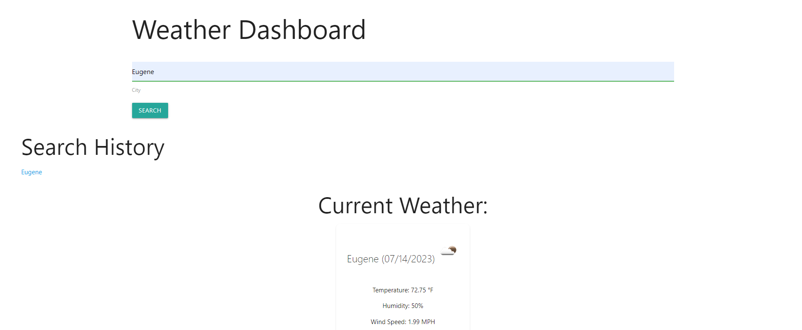

# Workday Planner

## Technology Used 

| Technology Used         | Resource URL           | 
| ------------- |:-------------:| 
| HTML    | [https://developer.mozilla.org/en-US/docs/Web/HTML](https://developer.mozilla.org/en-US/docs/Web/HTML) | 
| CSS     | [https://developer.mozilla.org/en-US/docs/Web/CSS](https://developer.mozilla.org/en-US/docs/Web/CSS)      |   
| Git | [https://git-scm.com/](https://git-scm.com/)     |  
| Axios | [https://www.npmjs.com/package/axios](https://www.npmjs.com/package/axios)     |  
|moment.js | [https://momentjs.com/](https://momentjs.com/)     |
|javascript | [https://developer.mozilla.org/en-US/docs/Web/JavaScript](https://developer.mozilla.org/en-US/docs/Web/JavaScript)     |
| icons | [https://fontawesome.com/](https://fontawesome.com/)     |

## Description 

[Visit the Deployed Site](https://lth1013.github.io/weather-dashboard/)

AS A traveler
I WANT to see the weather outlook for multiple cities
SO THAT I can plan a trip accordingly

GIVEN a weather dashboard with form inputs
WHEN I search for a city
THEN I am presented with current and future conditions for that city and that city is added to the search history
WHEN I view current weather conditions for that city
THEN I am presented with the city name, the date, an icon representation of weather conditions, the temperature, the humidity, and the wind speed
WHEN I view future weather conditions for that city
THEN I am presented with a 5-day forecast that displays the date, an icon representation of weather conditions, the temperature, the wind speed, and the humidity
WHEN I click on a city in the search history
THEN I am again presented with current and future conditions for that city

This website enables you to do multiple things. First, you can input a city and find the current weather. Then, you can find the 5 day forecast for that city. Finally, you can click on the city in the search history and find the weather for that city again. 
## Usage 

To use this website, type in the city you want to search for. Then, click the search button. The current weather will appear on the right side of the screen. The 5 day forecast will appear below the current weather. If you want to search for the weather in a city you have already searched for, click on the city in the search history.

## Author Info

### Luke Harriman

* [Github](https://github.com/lth1013)